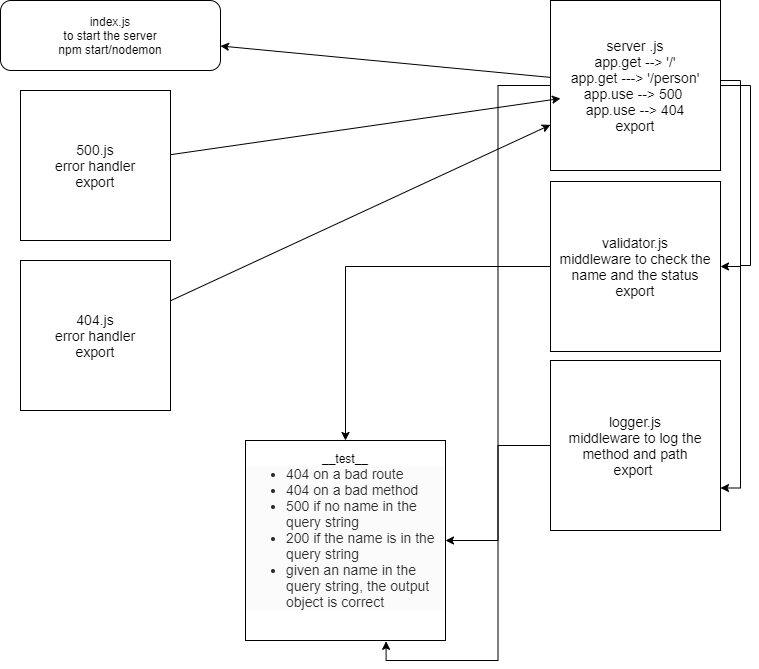

# basic-express-server

## LAB - 02

### Author: Ibrahem Sarayrah

### LINKS

* [github action](https://github.com/IbrahemSarayrah/basic-express-server/actions)

* [github action test](https://github.com/IbrahemSarayrah/basic-express-server/runs/3341903975)

* HEROKU Prod : [https://ibrahem--basic-express-server.herokuapp.com/](https://ibrahem--basic-express-server.herokuapp.com/)

* pull request : [https://github.com/IbrahemSarayrah/basic-express-server/pull/1](https://github.com/IbrahemSarayrah/basic-express-server/pull/1)

### Setup

* **.env** requirements:
>
> PORT=3000
>

### Running the app

* npm start / nodemon

* Endpoint: `/person?name="name provided"`

* Returns Object

```
{ name: "name provided" }
```

* [https://ibrahem--basic-express-server.herokuapp.com/person?name=ibrahem](https://ibrahem--basic-express-server.herokuapp.com/person?name=ibrahem)

### UML

